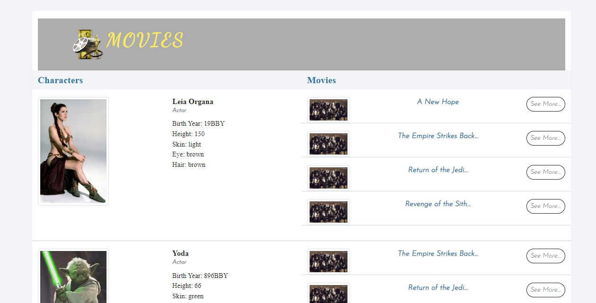

# Movies

#### [live Site](https://ahwalid.github.io/Movies/)

#### [github Code](https://github.com/ahwalid/Movies/tree/master)

it's  simple website for **Pre-Work for Code The Dream's fall 2022 cleasses**, 
on this website we are going to display Actors of Moices which some Movice of them, and details of thier Movices. 
we are suing API for getting data.

## API
we are using the flowing API's to display on this website
#### [https://swapi.dev/api/people/5/](https://swapi.dev/api/people/5/)
#### [https://swapi.dev/api/people/20/](https://swapi.dev/api/people/20/)
#### [https://swapi.dev/api/people/9/](https://swapi.dev/api/people/9/)
#### [https://swapi.dev/api/people/6/](https://swapi.dev/api/people/6/)

By Clicking on the See More button details of the Movie is going to display like the image

## Technologies

* Languages Used
    - HTML5
    - CSS3
    - JavaScript

* IDE & Libraries Used
    - **Git:** is used for variety control to apply the Gitpod terminal to Git commit and push the GitHub.
    - **GitHub:** is used to collect codes of the project after the project codes are pushed from Git.

## Testing
* HTML 
    - All codes are validate and there were no errors when we check through the [W3C HTML Validator](https://validator.w3.org/)
       
* CSS 
    - All codes are validate and there were no errors when we check through the [W3C CSS Validator](https://jigsaw.w3.org/css-validator/)

* JavaScript
    - just some warnings , no other errors were found using JSHint validator testing.

##### Developed by: **Ahmad Walid Ahmadyar**
##### Date: **August/27/2022**

**CODE THE DREAM**
**Advance Claess Pre-Work**